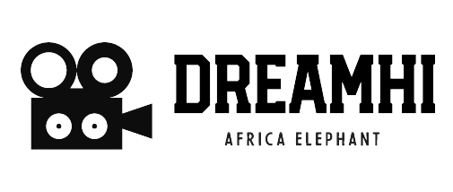
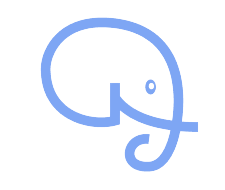
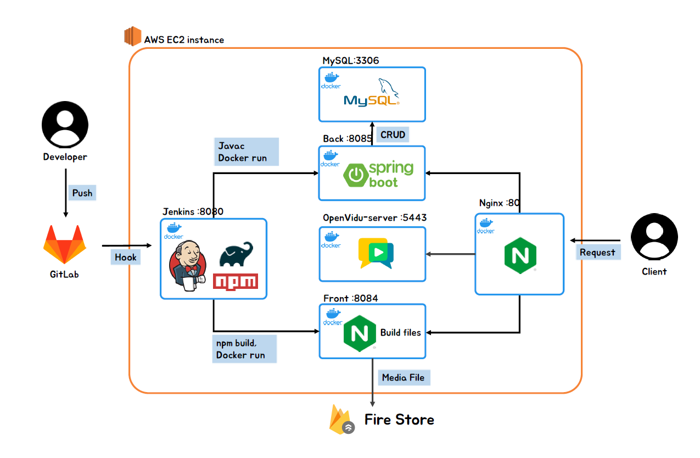

# :elephant: 아프리카 코끼리

# 🌟 DreamHi - 배우 오디션 플랫폼

---

[](https://dreamhi.p-e.kr)  
[DreamHi 페이지로 이동](https://dreamhi.p-e.kr)

##  팀소개 - 아프리카 코끼리

---

삼성 청년 SW 아카데미 8기 2학기 공통 프로젝트팀

:crown: Team Leader : 배창민 <br>
:muscle: FrontEnd Leader : 정지은 <br>
:clown_face: BackEnd : 이다운 <br>
:clown_face: BackEnd : 황준현 <br>
:smiley_cat: FrontEnd : 이여민 <br>
:smiley_cat: FrontEnd : 정효상 <br>

## 📅 프로젝트 기간
> 2023.01.09 (월) ~ 2023.02.17(금)
---


- 2023.01.05(목) ~ 2023.01.09(월) 
  - 아이디어 선정
- 2023.01.10(화) ~ 2023.01.13(금)
  - [기능명세서 작성](output/기능명세서/README.md)
  - [와이어프레임 제작](output/프로토타입/README.md)
- 2023.01.16(월) ~ 2023.01.27(금)
  - [프로토타입 제작](output/프로토타입/README.md)
  - [ERD 작성](output/ERD/README.md)
  - [시퀀스 다이어그램 작성](output/시퀀스 다이어그램/README.md)
- 2023.01.30(월) ~ 2023.02.10(금)
  - [API 명세서 작성](output/API/README.md)
  - [배포 환경 구성](#-시스템-아키텍처)
  - [BackEnd 구현](#-기술-스택) 
  - [FrontEnd 구현](#-기술-스택)
  - OpenVidu 적용
- 2023.02.13(월) ~ 2023.02.15(금)
  - [FrontEnd 구현](#-기술-스택)
  - E2E 테스트 및 버그 수정
  - 산출물 문서화

## 📝 DreamHi - 배경

---

우리가 극장에서 흔히 볼 수 있는 영화의 경우 막대한 자본을 이용하여 주연 배우를 캐스팅하고, 인맥을 동원한 오디션으로 단역을 뽑으면 되기 때문에 배우를 캐스팅하는 작업에서 별다른 어려움이 없어보일 수 있다.

하지만, 대부분의 저예산 영화 또는 독립 영화는 배우를 모집하는 데 제작자(제작팀)의 상당한 에너지 소모를 필요로 한다. 오디션을 통한 캐스팅 프로세스를 **아직도 이메일과 오프라인 면접으로 진행**하고 있기 때문이다.

게다가, 배우의 상황도 녹록치 않다. 영화 오디션 공고가 **각종 커뮤니티에 중구난방으로 게시**되고 있기 때문에, 단순히 오디션 공고를 찾는 작업 조차도 그리 간단치 못하기 때문이다.

결과적으로 우리는 소규모 제작팀과 배우를 위한 영화 오디션 플랫폼이 부재하다는 것을 문제의 원인으로 꼽았다.

## 📝 DreamHi - 개요

---

영화 오디션 플랫폼을 통해

> `제작자`가 자신의 작품에 어울리는 배우를 체계적으로, 간편하게 찾을 수 있고,
>
>`배우`가 더 많은 오디션에 간편하게 지원하여 기회를 얻도록  

돕는다.

## 👍 Benefit

---

`제작자(제작팀)`

- 배우 모집 공고를 쉽게 등록하고, 관리할 수 있다.
- 오디션 프로세스를 체계적으로 진행할 수 있다.
- 화상 오디션을 이용하면 짧은 시간 동안 더 많은 지원자를 만날 수 있다.

`배우`

- 배우 모집 공고를 한 곳에서 확인하고, 지원할 수 있다.
- 자기소개를 위한 이력서, 자료 등을 간편하게 관리할 수 있다.

## 🏗️ 시스템 아키텍처

---



## ✅ 기술 스택

---

### Front-End

- HTML/CSS/JavaScript
- React 18.2.0
- Recoil 0.7.6
- React-Bootstrap 2.7.0
- Tailwind 3.0.2
- MaterialUI 4.12.4
- OpenVidu 2.25.0

### Back-End

- JAVA 11
- Spring Boot (Gradle groovy) 2.7.7
- Spring Security 
- Spring Data JPA
- QueryDsl
- MySQL 8.0.31

### Dev-ops
- Docker
- jenkins
- nginx

## ✅ 협업 툴

---

- Jira
- Gitlab
- Mattermost
- Notion

## 📝 프로젝트 파일 구조

---

### back-end

```
└── Dream-Hi
    └── src
        └── main
            ├── java
            │   └── com
            │       └── elephant
            │           └── dreamhi
            │               ├── configuration
            │               │   └── converter
            │               ├── controller
            │               ├── exception
            │               ├── model
            │               │   ├── dto
            │               │   ├── entity
            │               │   └── statics
            │               ├── repository
            │               ├── security
            │               │   ├── jwt
            │               │   └── oauth
            │               │       └── provider
            │               ├── service
            │               └── utils
            └── resources
```

### front-end

```
|-- components
|   |-- Actor
|   |   |-- filmo
|   |   |-- info
|   |   |-- photo
|   |   `-- video
|   |-- Announcement
|   |-- Audition
|   |-- Calendar
|   |-- Casting
|   |-- Collection
|   |-- Common
|   |   |-- CommonComponent
|   |   `-- MainLayout
|   |-- Live
|   |-- Main
|   `-- Maker
|       |-- AnnouncementList
|       |-- Filmo
|       |-- Info
|       `-- MakerMembers
|-- constants
|-- imageup
|-- img
|   `-- Icons
|-- lib
|   `-- styles
|-- pages
|   `-- Login
|-- recoil
|   |-- actor
|   |-- announcement
|   |-- book
|   |-- maker
|   |-- process
|   |-- user
|   `-- volunteer
|-- service
|   `-- audition
|-- user
|   |-- login
|   `-- oauth2
`-- util

```

## 📝 프로젝트 산출물

---

- [회의록](output/meeting-log)
- [기능 명세서](output/기능명세서/README.md) ( updated 23.01.16 )
- [프로토타입](output/프로토타입/README.md)
- [시퀀스 다이어그램](output/시퀀스 다이어그램/README.md) ( updated 23.01.23 )
- [시스템 아키텍처](#-시스템-아키텍처)
- [와이어프레임](output/프로토타입/README.md)
- [컨벤션](output/docs/README.md)
- [API](output/API/README.md)
- [ERD](output/ERD/README.md)
- [E2E 테스트 케이스](https://docs.google.com/spreadsheets/d/16IVVm1V1fmuVT7mTiPPC1_Gx9Uwhbqojm7hqa-oafSk/edit#gid=0)
- [발표 자료](output/발표 자료/README.md)

## 🔥 트러블 슈팅

---

- 추가예정