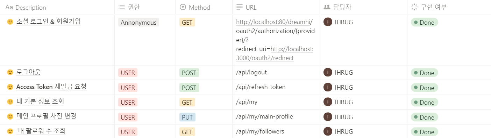
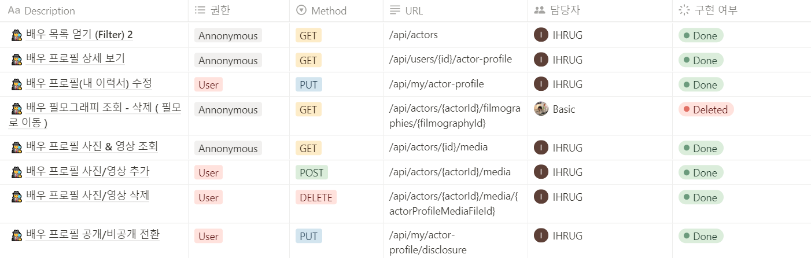
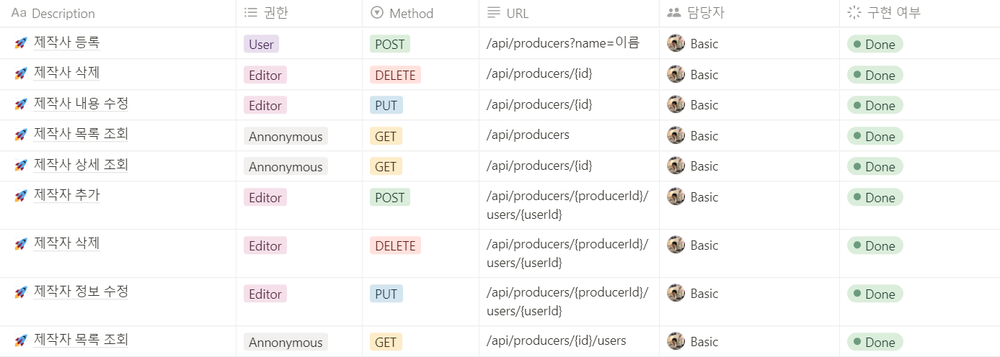
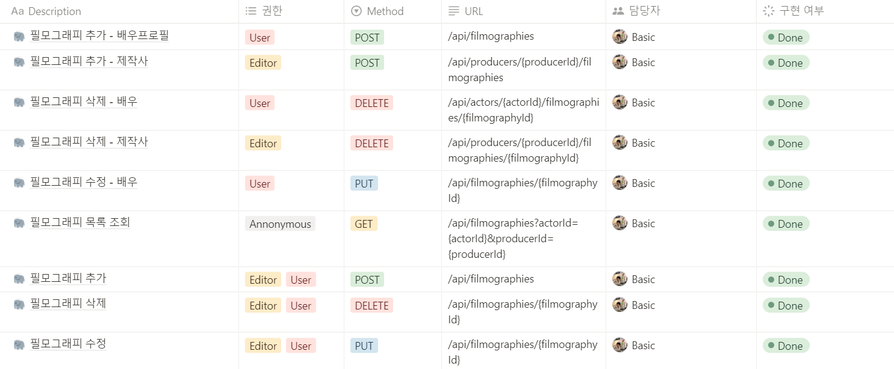
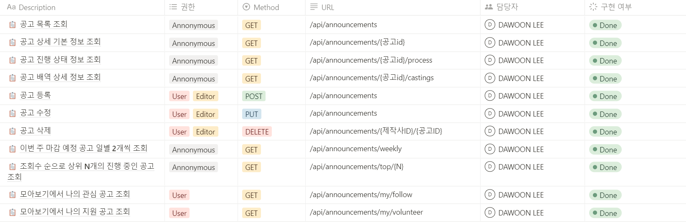
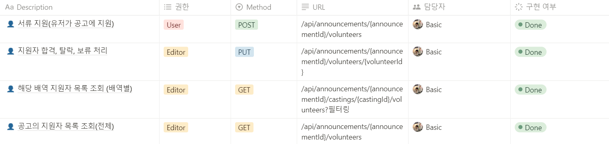
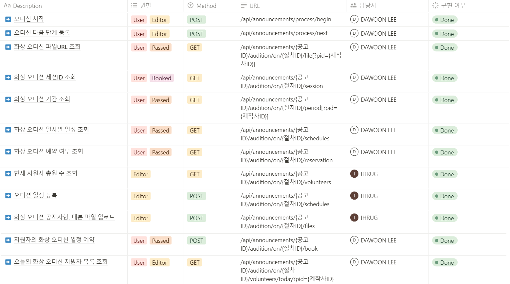
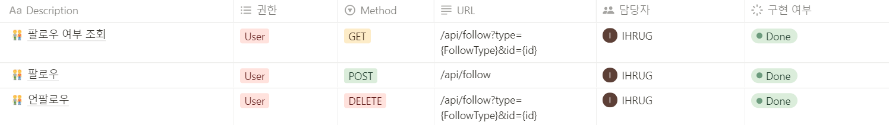

# API 명세서

> 전체 보기   
> https://www.notion.so/ludwings/8-API-14e59ec8fd7a4d8ea74ae8180791b92a?pvs=4

---

### [회원 관리](https://www.notion.so/a07993fe983649c887f5398d4b8d74f5)

---

### [배우](https://www.notion.so/8ca26f6b607344b3a527b0df0da98f4f)

---

### [제작사](https://www.notion.so/6b8385a0309e40df9deb874c18fd7c45)

---

### [필모그래피](https://www.notion.so/9dbdd7c118034bdfae3342cfe8ad3ed4)

---

### [공고](https://www.notion.so/c8a8fd996fdc4506bdb7b4ea9f490a4b)

---

### [지원자 관리](https://www.notion.so/6ec57362ac624f1e8cccd061275eab6f)

---

### [오디션](https://www.notion.so/a3145565db494f0a8e45f3064eea1312)

---

### [팔로우](https://www.notion.so/9233421dff804b8aa8c6b6048b8983a9)

