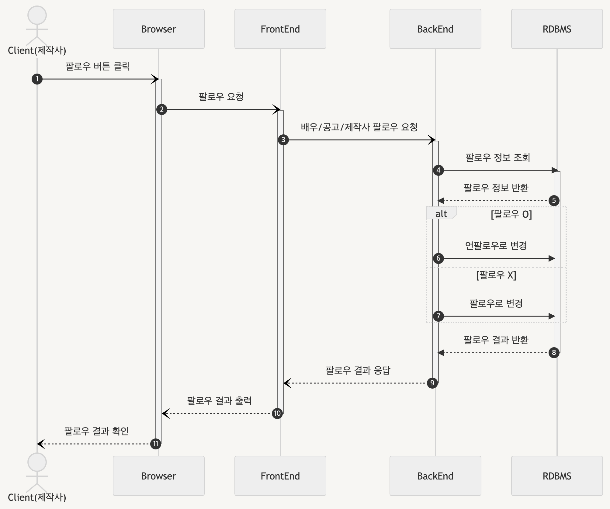
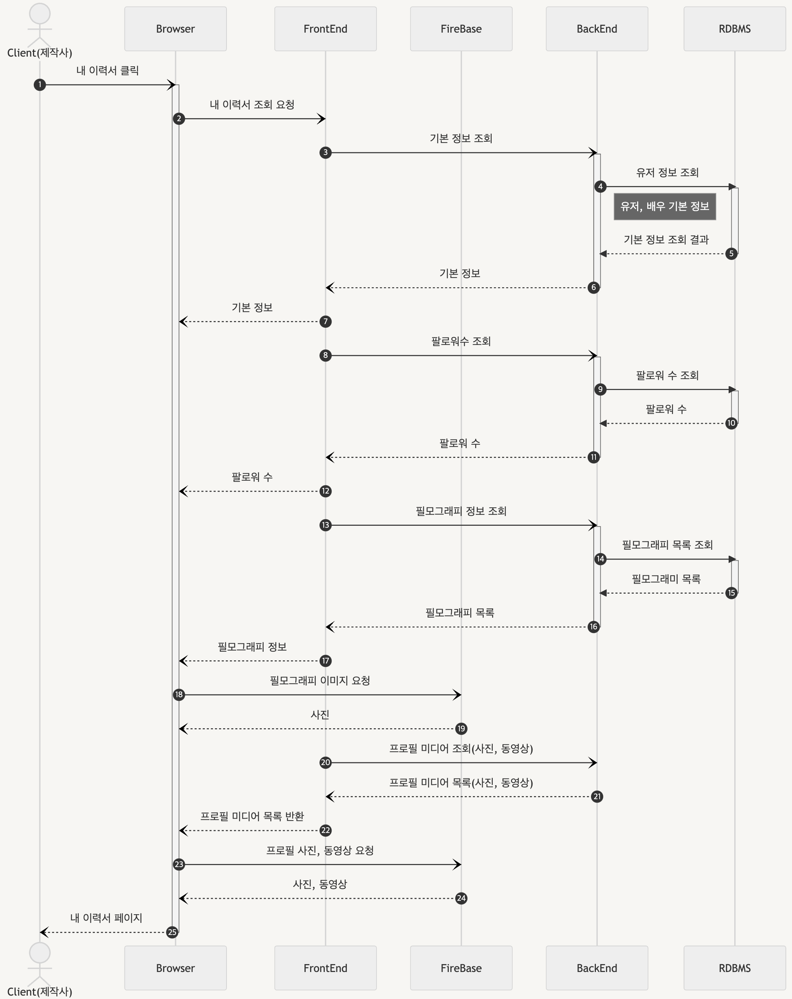
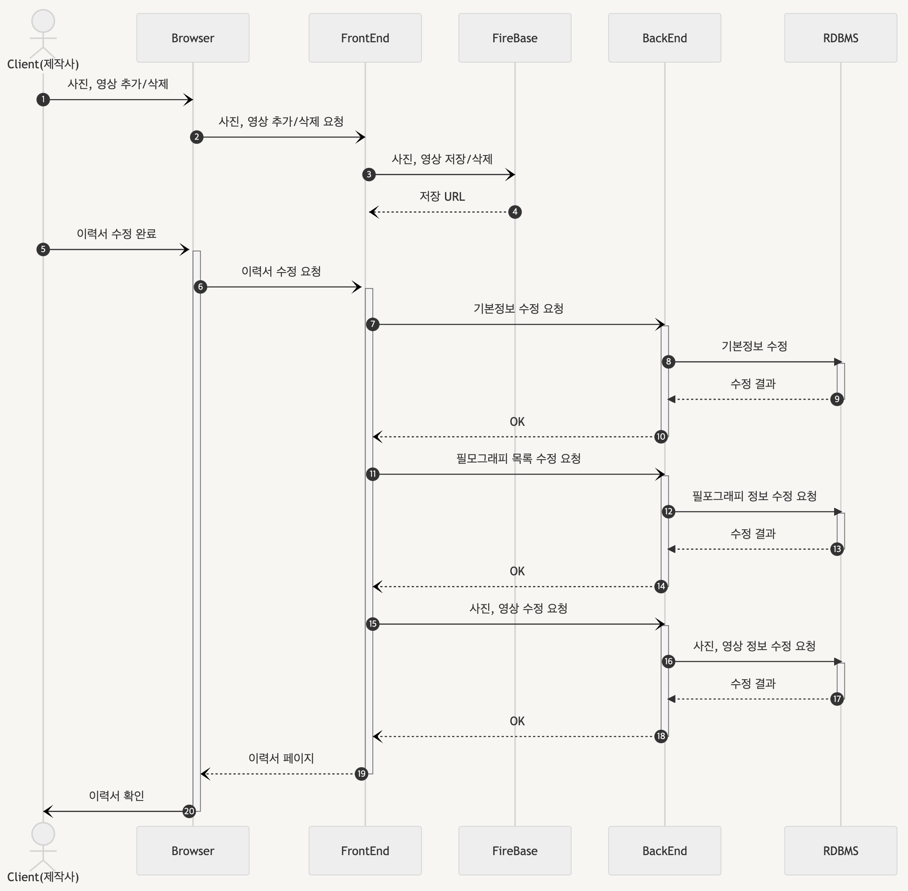
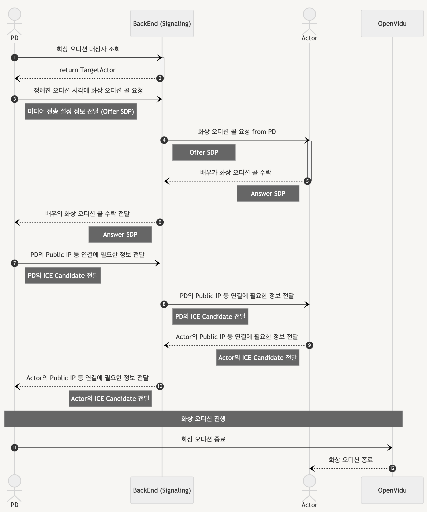

# 시퀀스 다이어그램

> [Notion 링크](https://ludwings.notion.site/4-96a91de3002d49d5bf22ee30f91ebd0c)

---

## 회원 관리

---

### 소셜 로그인

---

### 소셜 회원가입

---

### 로그아웃

---

## 배우

---

### 배우 목록 조회

---

### 배우 프로필

**상세 요청**

**수정 요청**

---

## 공고

---

### 공고 리스트 조회

---

### 공고 기본 정보 조회

---

### 공고 캐스팅 배역 정보

---

### 공고 모집 현황 / 지원 현황

---

### 공고 상세 조회

---

### 공고 등록

---

## 제작사

---

### 제작사 리스트 조회

---

### 제작진 리스트 조회

---

### 제작진 추가

---

## 채용 관리

---

### 지원자 목록 조회

---

### 지원자 합격/보류/불합격 선택

---

---

### 다음 프로세스 진행 시 결과 통보

---

## 등록 & 수정

---

### 사진, 동영상 등록

---

## 팔로우 기능

---

### 배우 팔로우/언팔로우

---

## 내 정보 관리

---

### 내 이력서 조회

----

### 이력서 수정

---

## 화상 오디션

---

### OpenVidu

