# 시퀀스 다이어그램

> [Notion 링크](https://ludwings.notion.site/4-96a91de3002d49d5bf22ee30f91ebd0c)

---

## 내용

---

# 4. 시퀀스 다이어그램

시작일: 2023년 1월 13일

# Sequence Diagram

[Sequence diagrams | Mermaid](https://mermaid.js.org/syntax/sequenceDiagram.html)

## 회원 관리

### 이메일 인증

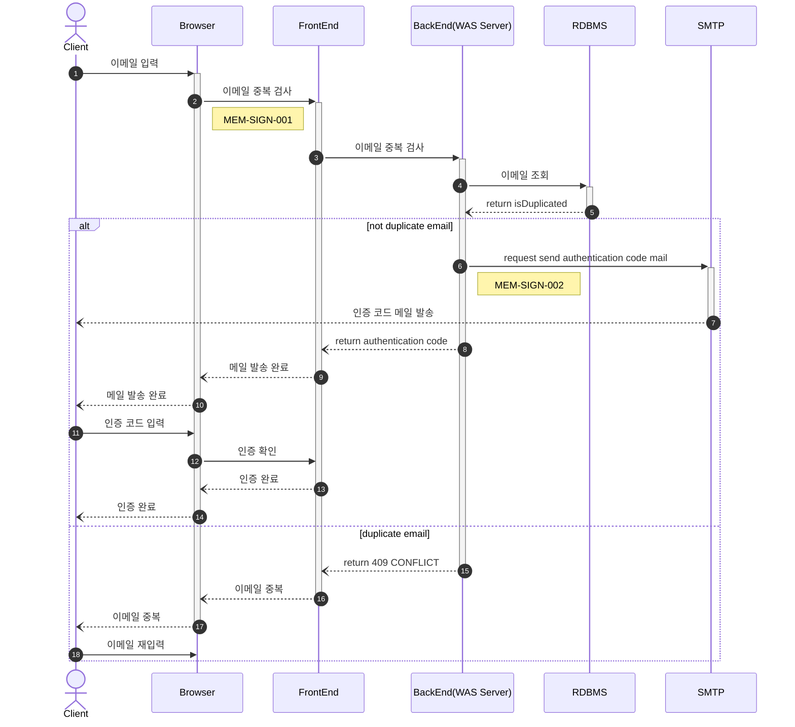
```mermaid
sequenceDiagram
	autonumber
	actor C as Client
	participant B as Browser
	participant FE as FrontEnd
	participant BE as BackEnd(WAS Server)
	participant DB as RDBMS
  participant M as SMTP
	C->>+B:이메일 입력
	B->>+FE: 이메일 중복 검사 
	note right of B: MEM-SIGN-001
	FE->>+BE: 이메일 중복 검사 
	BE->>+DB: 이메일 조회
	DB--)-BE: return isDuplicated
	alt not duplicate email
		BE->>+M: request send authentication code mail
		note right of BE: MEM-SIGN-002
		M--)-C: 인증 코드 메일 발송
		BE--)FE: return authentication code
		FE--)B: 메일 발송 완료
		B--)C: 메일 발송 완료
		C->>B: 인증 코드 입력
		B->>FE: 인증 확인
		FE--)B: 인증 완료
		B--)C: 인증 완료	
	else duplicate email
		BE--)-FE: return 409 CONFLICT
    FE--)-B: 이메일 중복
		B--)-C: 이메일 중복
		C->>B: 이메일 재입력
	
	end
  
```

### 휴대폰 인증

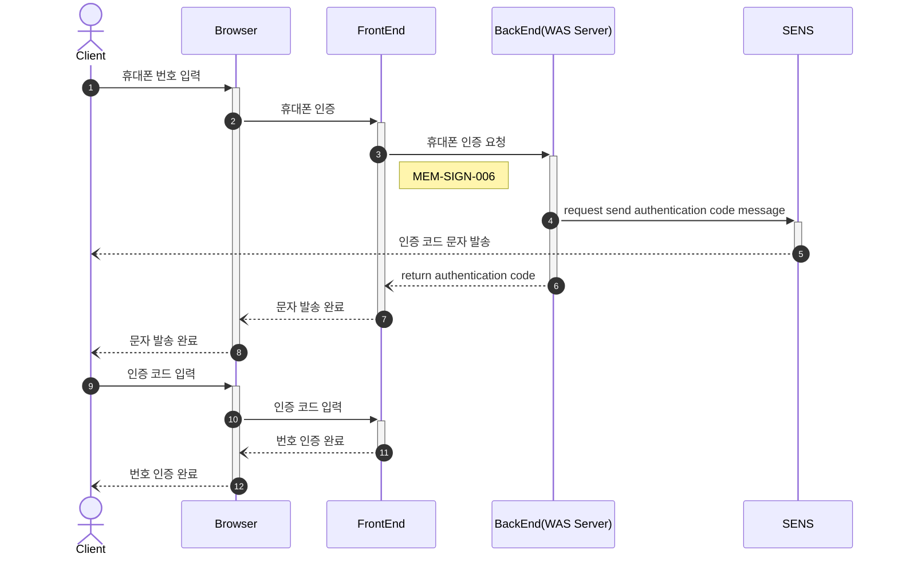
```mermaid
sequenceDiagram
	autonumber
	actor C as Client
	participant B as Browser
	participant FE as FrontEnd
	participant BE as BackEnd(WAS Server)
  participant S as SENS
	C->>+B: 휴대폰 번호 입력
	B->>+FE: 휴대폰 인증
	FE->>+BE: 휴대폰 인증 요청
	note right of FE: MEM-SIGN-006
	BE->>+S: request send authentication code message
	S--)-C: 인증 코드 문자 발송
	BE--)-FE: return authentication code
	FE--)-B: 문자 발송 완료
	B--)-C: 문자 발송 완료

	C->>+B: 인증 코드 입력
	B->>+FE: 인증 코드 입력
	FE--)-B: 번호 인증 완료
	B--)-C: 번호 인증 완료
 
```

### 이메일 회원 가입

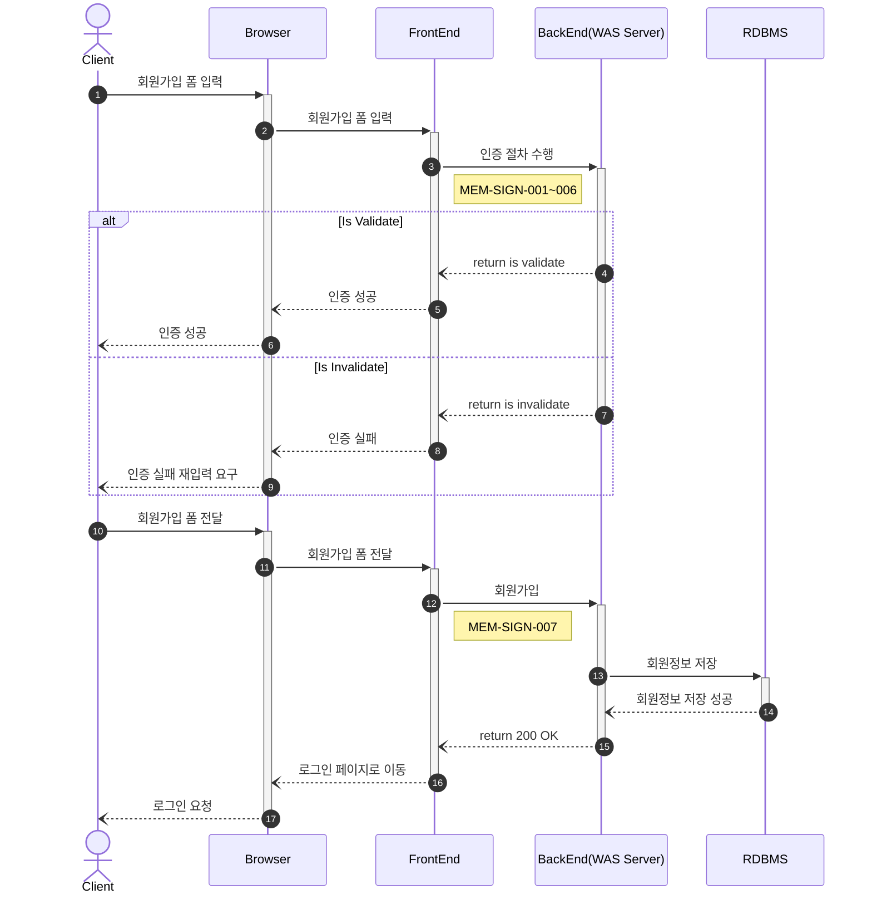
```mermaid
sequenceDiagram
  autonumber
  actor C as Client
  participant B as Browser
  participant FE as FrontEnd
  participant BE as BackEnd(WAS Server)
  participant DB as RDBMS
	C->>+B: 회원가입 폼 입력
	B->>+FE: 회원가입 폼 입력
	FE->>+BE: 인증 절차 수행
	note right of FE: MEM-SIGN-001~006

	alt Is Validate
		BE--)FE: return is validate
		FE--)B: 인증 성공 
		B--)C: 인증 성공
	else Is Invalidate
		BE--)-FE: return is invalidate
		FE--)-B: 인증 실패
		B--)-C: 인증 실패 재입력 요구
	end

	C->>+B: 회원가입 폼 전달
	B->>+FE: 회원가입 폼 전달
	FE->>+BE: 회원가입
	note right of FE: MEM-SIGN-007
	BE->>+DB: 회원정보 저장
	DB--)-BE: 회원정보 저장 성공
	BE--)-FE: return 200 OK
	FE--)-B: 로그인 페이지로 이동
	B--)-C: 로그인 요청
	
```

### 이메일 로그인

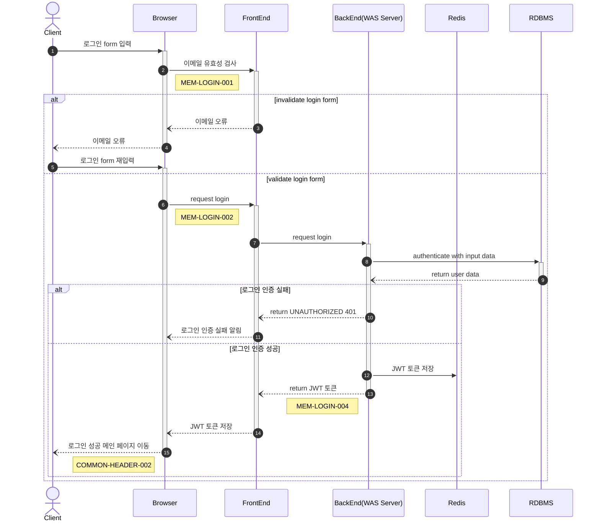
```mermaid
sequenceDiagram
    autonumber
    actor A as Client
    participant B as Browser
    participant C as FrontEnd
    participant D as BackEnd(WAS Server)
    participant E as Redis
    participant F as RDBMS
    A->>+B: 로그인 form 입력
		B->>+C: 이메일 유효성 검사
		note right of B: MEM-LOGIN-001
		alt invalidate login form
			C--)-B: 이메일 오류
			B--)-A: 이메일 오류
			A->>+B: 로그인 form 재입력
		else validate login form
	    B->>+C: request login 
			note right of B: MEM-LOGIN-002
	    C->>+D: request login
	    D->>+F: authenticate with input data
	    F--)-D: return user data
			alt 로그인 인증 실패
				D--)C: return UNAUTHORIZED 401
				C--)B: 로그인 인증 실패 알림
			else 로그인 인증 성공
				D->>E: JWT 토큰 저장
				D--)-C: return JWT 토큰 
				note left of D: MEM-LOGIN-004
				C--)-B: JWT 토큰 저장
				B--)-A: 로그인 성공 메인 페이지 이동 
				note left of B: COMMON-HEADER-002
			end
	  end
```

### 소셜 회원가입

- 회원가입 클릭 전 시퀀스는 [소셜 로그인](https://www.notion.so/bb7cb7c5e94a420da577b9710725e7b7) 참조

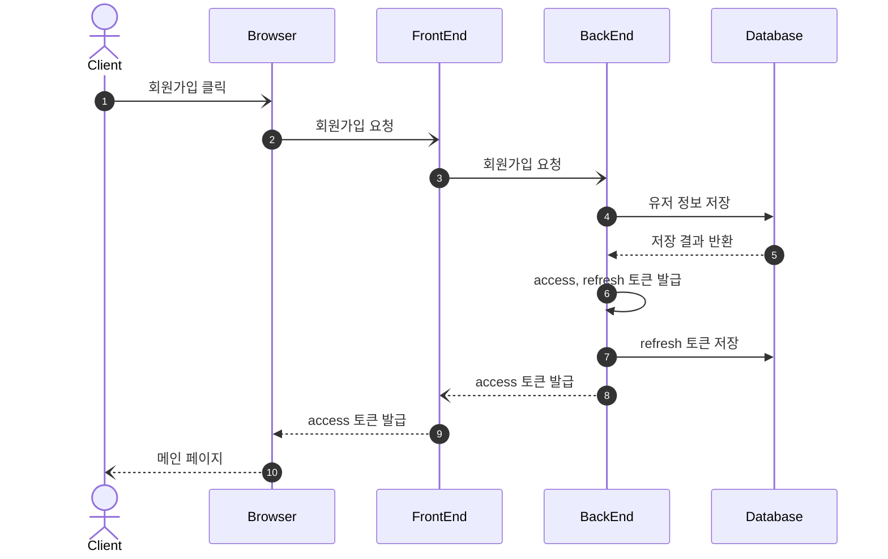
```mermaid
sequenceDiagram
	autonumber

	actor C as Client
	participant B as Browser
	participant FE as FrontEnd
	participant BE as BackEnd
	participant DB as Database
	
	C-)B: 회원가입 클릭
	B-)FE: 회원가입 요청
	FE-)BE: 회원가입 요청
	BE->>DB: 유저 정보 저장
	DB-->>BE: 저장 결과 반환
	BE->>BE: access, refresh 토큰 발급
	BE->>DB: refresh 토큰 저장
	BE--)FE: access 토큰 발급
	FE-->>B: access 토큰 발급
	B--)C: 메인 페이지
	

```

### 소셜 로그인

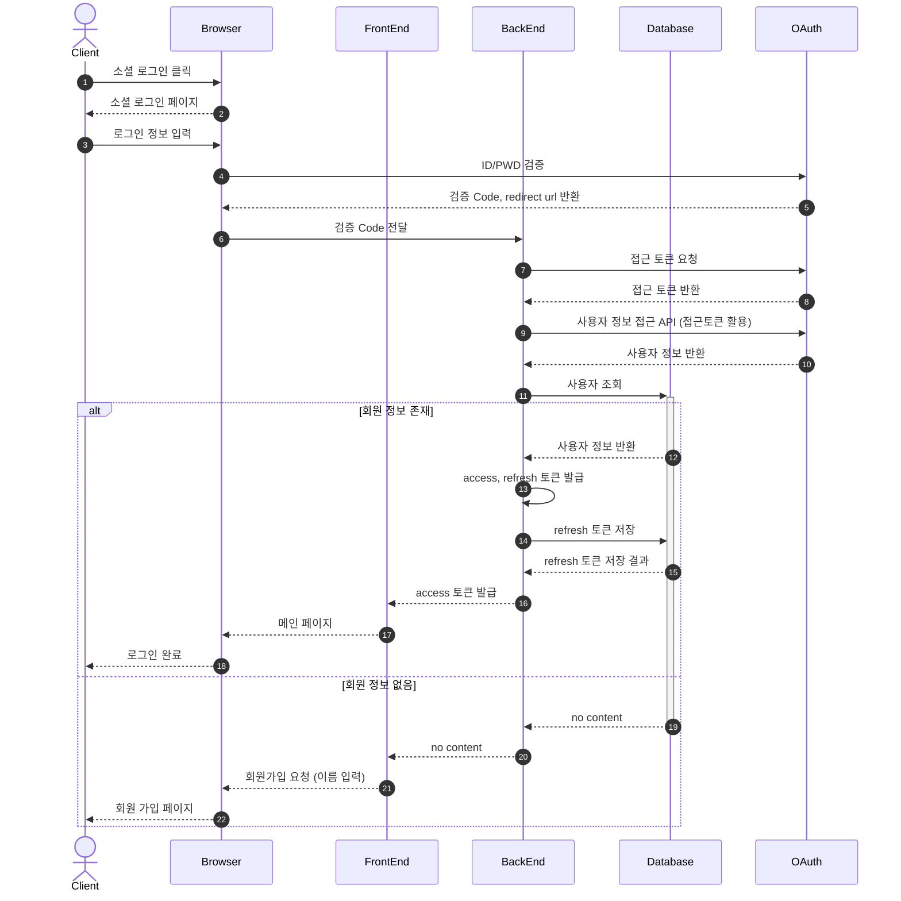
```mermaid
sequenceDiagram
	autonumber

	actor C as Client
	participant B as Browser
	participant FE as FrontEnd
	participant BE as BackEnd
	participant DB as Database
	participant OA as OAuth

	C->>B: 소셜 로그인 클릭
	B-->>C: 소셜 로그인 페이지
	C->>B: 로그인 정보 입력
	B->>OA: ID/PWD 검증
	OA-->>B: 검증 Code, redirect url 반환
	B->>BE: 검증 Code 전달
	BE->>OA: 접근 토큰 요청
	OA-->>BE: 접근 토큰 반환
	BE->>OA: 사용자 정보 접근 API (접근토큰 활용)
	OA-->>BE: 사용자 정보 반환
	BE->>+DB: 사용자 조회
	alt 회원 정보 존재
	DB-->>BE: 사용자 정보 반환
	BE->>BE: access, refresh 토큰 발급
	BE->>DB: refresh 토큰 저장
	DB-->>BE: refresh 토큰 저장 결과
	BE-->>FE: access 토큰 발급
	FE-->>B: 메인 페이지
	B-->>C: 로그인 완료
	else 회원 정보 없음
	DB-->>-BE: no content
	BE-->>FE: no content
	FE-->>B: 회원가입 요청 (이름 입력)
	B-->>C: 회원 가입 페이지
	end
	
```

### 로그아웃

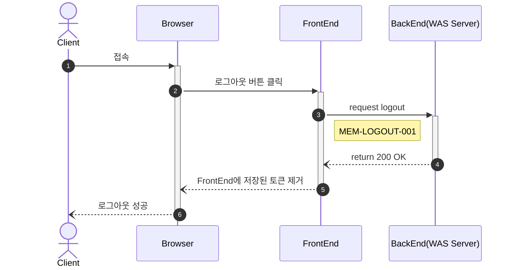
```mermaid
sequenceDiagram
	autonumber
	actor C as Client
	participant B as Browser
	participant FE as FrontEnd
	participant BE as BackEnd(WAS Server)
	C->>+B: 접속
	B->>+FE: 로그아웃 버튼 클릭
	FE->>+BE: request logout
	note right of FE: MEM-LOGOUT-001
	BE--)-FE: return 200 OK
	FE--)-B: FrontEnd에 저장된 토큰 제거
	B--)-C: 로그아웃 성공
 
```

### 토큰 재발급

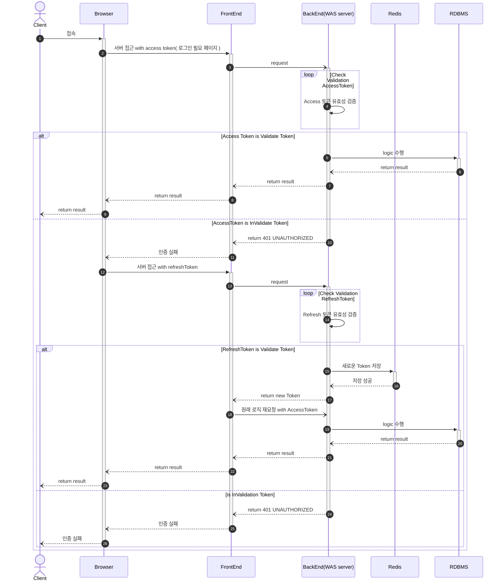
```mermaid
sequenceDiagram
	autonumber
	actor C as Client
	participant B as Browser
	participant FE as FrontEnd
	participant BE as BackEnd(WAS server)
	participant RD as Redis
	participant DB as RDBMS
	C->>+B: 접속 
	B->>+FE: 서버 접근 with access token( 로그인 필요 페이지 )
	FE-)+BE: request
	loop Check Validation AccessToken
    BE->>BE: Access 토큰 유효성 검증
  end
	alt Access Token is Validate Token
		BE->>+DB: logic 수행
		DB--)-BE: return result 
		BE--)FE: return result
		FE--)B: return result
		B--)C: return result
	else AccessToken is InValidate Token
		BE--)-FE: return 401 UNAUTHORIZED
		FE--)-B: 인증 실패
		B->>+FE: 서버 접근 with refreshToken	
		FE->>+BE: request
		loop Check Validation RefreshToken
    BE->>BE: Refresh 토큰 유효성 검증
	  end
		alt RefreshToken is Validate Token
			BE->>+RD: 새로운 Token 저장
			RD--)-BE: 저장 성공
			BE--)FE: return new Token 
			FE-)BE: 원래 로직 재요청 with AccessToken
			BE->>+DB: logic 수행
			DB--)-BE: return result 
			BE--)FE: return result
			FE--)B: return result
			B--)C: return result
		else is InValidation Token
			BE--)-FE: return 401 UNAUTHORIZED
			FE--)-B: 인증 실패
			B--)-C: 인증 실패
		end
	end
	
```

---

## 배우

### 배우 목록(리스트) 조회

**필터링 기능 존재**

- 키 / 나이 / 성별 / 스타일 / 나의 팔로우 배우 / 이름

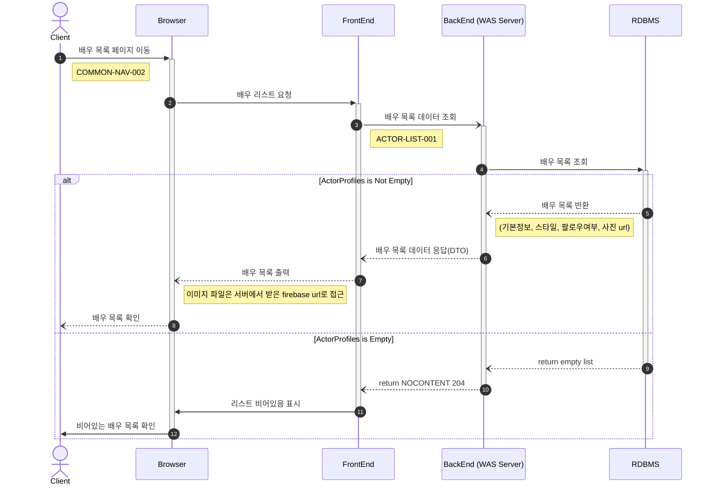
```mermaid
sequenceDiagram
	autonumber

	actor C as Client
	participant B as Browser
  participant FE as FrontEnd
  participant BE as BackEnd (WAS Server)
  participant DB as RDBMS
	
	C->>+B: 배우 목록 페이지 이동
	note right of C: COMMON-NAV-002

	B->>+FE: 배우 리스트 요청
	FE-)+BE: 배우 목록 데이터 조회
	note right of FE: ACTOR-LIST-001
	BE->>+DB: 배우 목록 조회
	alt ActorProfiles is Not Empty

		DB--)BE: 배우 목록 반환
		note right of BE: (기본정보, 스타일, 팔로우여부, 사진 url)
		BE--)FE: 배우 목록 데이터 응답(DTO)

		FE--)B: 배우 목록 출력
		note left of FE: 이미지 파일은 서버에서 받은 firebase url로 접근
		B--)C: 배우 목록 확인
	else ActorProfiles is Empty
		DB--)-BE: return empty list
		BE--)-FE: return NOCONTENT 204
		FE->>-B: 리스트 비어있음 표시
		B->>-C: 비어있는 배우 목록 확인
	end

```

### **배우 프로필**

**상세 요청**

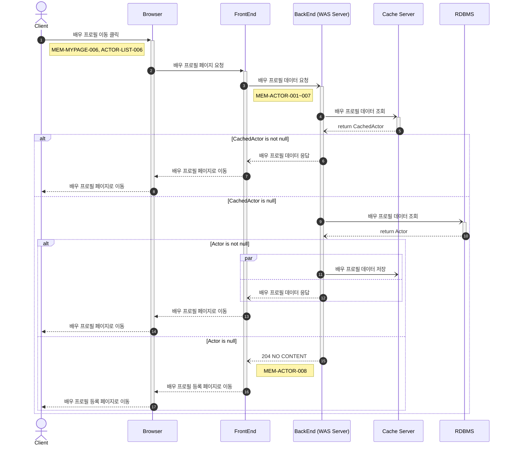
```mermaid
sequenceDiagram
	autonumber

	actor C as Client
	participant B as Browser
  participant FE as FrontEnd
  participant BE as BackEnd (WAS Server)
	participant CA as Cache Server
  participant DB as RDBMS
	
	C->>+B: 배우 프로필 이동 클릭
	note right of C: MEM-MYPAGE-006, ACTOR-LIST-006

	B->>+FE: 배우 프로필 페이지 요청
	FE-)+BE: 배우 프로필 데이터 요청
	note right of FE: MEM-ACTOR-001~007

	BE-)+CA: 배우 프로필 데이터 조회
	CA--)-BE: return CachedActor

	alt CachedActor is not null
		BE--)FE: 배우 프로필 데이터 응답
		FE-->>B: 배우 프로필 페이지로 이동
		B-->>C: 배우 프로필 페이지로 이동
	else CachedActor is null
		BE-)+DB: 배우 프로필 데이터 조회
		DB--)-BE: return Actor
		
		alt Actor is not null
			par 
					BE-)CA: 배우 프로필 데이터 저장
			and
					BE--)FE: 배우 프로필 데이터 응답
			end
			FE-->>B: 배우 프로필 페이지로 이동
			B-->>C: 배우 프로필 페이지로 이동
		else Actor is null
			BE--)-FE: 204 NO CONTENT
			note left of BE: MEM-ACTOR-008		
	
			FE-->>-B: 배우 프로필 등록 페이지로 이동
			B-->>-C: 배우 프로필 등록 페이지로 이동
		end
	end
```

**수정 요청**

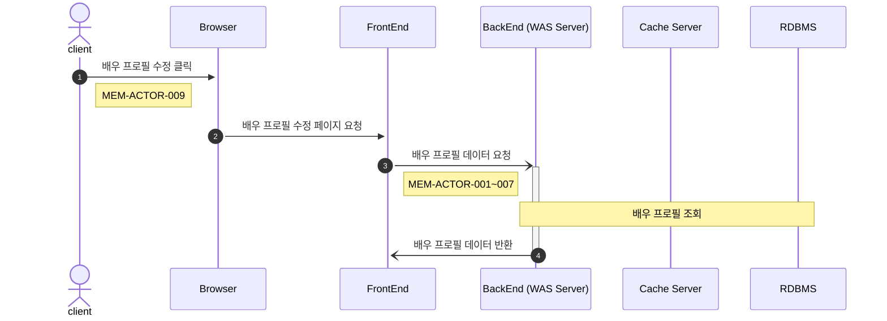
```mermaid
sequenceDiagram
	autonumber

	actor C as client
	participant B as Browser
  participant FE as FrontEnd
  participant BE as BackEnd (WAS Server)
	participant CA as Cache Server
  participant DB as RDBMS
	
	C->>+B: 배우 프로필 수정 클릭
	note right of C: MEM-ACTOR-009

	B->>+FE: 배우 프로필 수정 페이지 요청
	FE-)+BE: 배우 프로필 데이터 요청
	note right of FE: MEM-ACTOR-001~007

	note over BE, DB: 배우 프로필 조회

	BE-)-FE: 배우 프로필 데이터 반환
	
```

---

## 공고

### 공고 리스트 조회

**필터링 기능 존재**

- 키 / 나이 / 성별 / 스타일 / 나의 팔로우 공고 / 이름 / 상위 N개 노출

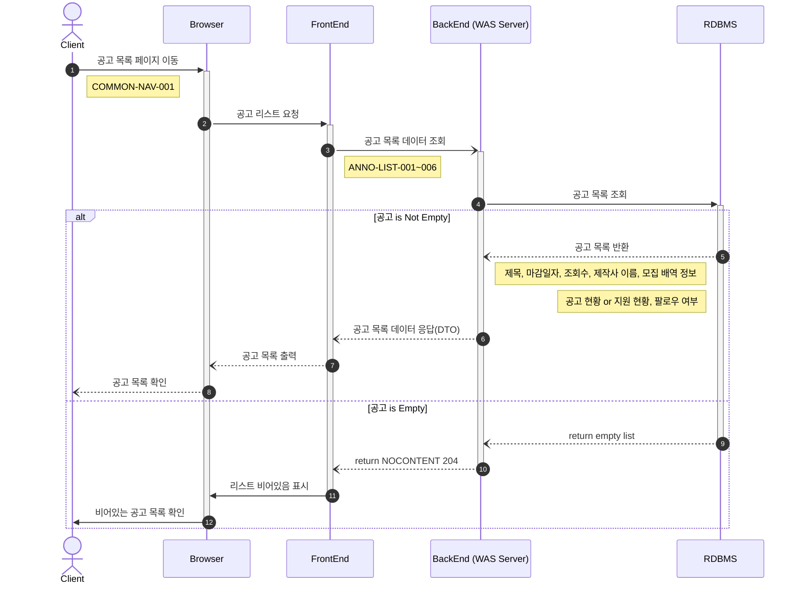
```mermaid
sequenceDiagram
	autonumber

	actor C as Client
	participant B as Browser
  participant FE as FrontEnd
  participant BE as BackEnd (WAS Server)
  participant DB as RDBMS
	
	C->>+B: 공고 목록 페이지 이동
	note right of C: COMMON-NAV-001

	B->>+FE: 공고 리스트 요청
	FE-)+BE: 공고 목록 데이터 조회
	note right of FE: ANNO-LIST-001~006
	BE->>+DB: 공고 목록 조회
	alt 공고 is Not Empty

		DB--)BE: 공고 목록 반환
		note left of DB: 제목, 마감일자, 조회수, 제작사 이름, 모집 배역 정보
		note left of DB: 공고 현황 or 지원 현황, 팔로우 여부
		BE--)FE: 공고 목록 데이터 응답(DTO)
		FE--)B: 공고 목록 출력
		B--)C: 공고 목록 확인
	else 공고 is Empty
		DB--)-BE: return empty list
		BE--)-FE: return NOCONTENT 204
		FE->>-B: 리스트 비어있음 표시
		B->>-C: 비어있는 공고 목록 확인
	end

```

### 공고 기본 정보 조회

- announcement, producer, follow 조회

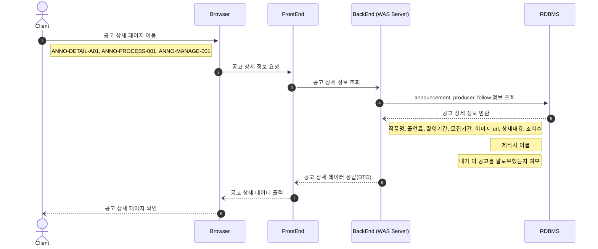
```mermaid
sequenceDiagram
	autonumber

	actor C as Client
	participant B as Browser
  participant FE as FrontEnd
  participant BE as BackEnd (WAS Server)
  participant DB as RDBMS
	
	C->>+B: 공고 상세 페이지 이동
	note right of C: ANNO-DETAIL-A01, ANNO-PROCESS-001, ANNO-MANAGE-001

	B->>+FE: 공고 상세 정보 요청
	FE-)+BE: 공고 상세 정보 조회
	BE->>+DB: announcement, producer, follow 정보 조회
	DB--)BE: 공고 상세 정보 반환
	note left of DB: 작품명, 출연료, 촬영기간, 모집기간, 이미지 url, 상세내용, 조회수
	note left of DB: 제작사 이름
	note left of DB: 내가 이 공고를 팔로우했는지 여부
	BE--)FE: 공고 상세 데이터 응답(DTO)
	FE--)B: 공고 상세 데이터 출력
	B--)C: 공고 상세 페이지 확인

```

### 공고 캐스팅 배역 정보

- casting, casting_style_relation, style

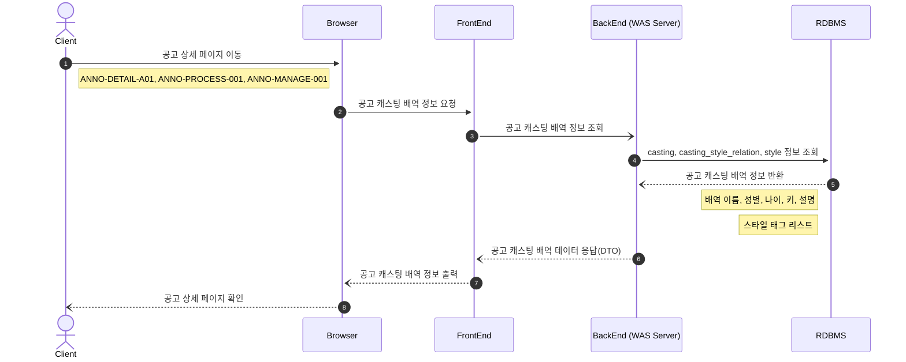
```mermaid
sequenceDiagram
	autonumber

	actor C as Client
	participant B as Browser
  participant FE as FrontEnd
  participant BE as BackEnd (WAS Server)
  participant DB as RDBMS
	
	C->>+B: 공고 상세 페이지 이동
	note right of C: ANNO-DETAIL-A01, ANNO-PROCESS-001, ANNO-MANAGE-001

	B->>+FE: 공고 캐스팅 배역 정보 요청
	FE-)+BE: 공고 캐스팅 배역 정보 조회
	BE->>+DB: casting, casting_style_relation, style 정보 조회

	DB--)BE: 공고 캐스팅 배역 정보 반환
	note left of DB: 배역 이름, 성별, 나이, 키, 설명
	note left of DB: 스타일 태그 리스트
	BE--)FE: 공고 캐스팅 배역 데이터 응답(DTO)
	FE--)B: 공고 캐스팅 배역 정보 출력
	B--)C: 공고 상세 페이지 확인

```

### 🚨공고 모집 현황 / 지원 현황 - 보류

**내부 필요 로직**

1. Volunteer → Process → Announcement  매핑걸려있다.
    - Volunteer에서 내 정보 조회하면 리스트 형태로 된다.
    - VolunteerList → process.annoucementId
2. fetch join
    - volunteer [left join] process [inner join] stage

3. 이 결과가 있다면 → 이 공고에 지원했다
    1. annoucement → 현재 지원 프로세스 (processId)  이거랑 비교를 해서
4. 결과 없다면 → 지원하지 않았다
    1. announcement [inner join] process [inner join] stage → 표시 가능

```mermaid
sequenceDiagram
	autonumber

	actor C as Client
	participant B as Browser
  participant FE as FrontEnd
  participant BE as BackEnd (WAS Server)
  participant DB as RDBMS
	
	C->>+B: 공고 목록 페이지 이동
	note right of C: COMMON-NAV-001

	B->>+FE: 공고 리스트 요청
	FE-)+BE: 공고 목록 데이터 조회
	note right of FE: ANNO-LIST-001~006
	BE->>+DB: 공고 목록 조회
	alt 공고 is Not Empty

		DB--)BE: 공고 목록 반환
		note left of DB: 제목, 마감일자, 조회수, 제작사 이름, 모집 배역 정보
		note left of DB: 공고 현황 or 지원 현황, 팔로우 여부
		BE--)FE: 공고 목록 데이터 응답(DTO)
		FE--)B: 공고 목록 출력
		B--)C: 공고 목록 확인
	else 공고 is Empty
		DB--)-BE: return empty list
		BE--)-FE: return NOCONTENT 204
		FE->>-B: 리스트 비어있음 표시
		B->>-C: 비어있는 공고 목록 확인
	end

```

### 🚨공고 신고 횟수 조회 - 보류

**내부 필요 로직**

- Redis ⇒ RDBMS 으로 먼저 작성하기
- {
  ”userId” :
  “producer” [
  “5”, “6”, “9”
  ],
  “annoucement” : [
  “1”,
  ]

} ⇒ 내가 신고한 내역은 보기 편함, 신고당한 횟수를 알기 어려워짐
DB 에 announcement, producer 필드로 신고 횟수를 추가
- RDBMS
  - 

```mermaid
sequenceDiagram
	autonumber

	actor C as Client
	participant B as Browser
  participant FE as FrontEnd
  participant BE as BackEnd (WAS Server)
  participant DB as RDBMS
	
	C->>+B: 공고 목록 페이지 이동
	note right of C: COMMON-NAV-001

	B->>+FE: 공고 리스트 요청
	FE-)+BE: 공고 목록 데이터 조회
	note right of FE: ANNO-LIST-001~006
	BE->>+DB: 공고 목록 조회
	alt 공고 is Not Empty

		DB--)BE: 공고 목록 반환
		note left of DB: 제목, 마감일자, 조회수, 제작사 이름, 모집 배역 정보
		note left of DB: 공고 현황 or 지원 현황, 팔로우 여부
		BE--)FE: 공고 목록 데이터 응답(DTO)
		FE--)B: 공고 목록 출력
		B--)C: 공고 목록 확인
	else 공고 is Empty
		DB--)-BE: return empty list
		BE--)-FE: return NOCONTENT 204
		FE->>-B: 리스트 비어있음 표시
		B->>-C: 비어있는 공고 목록 확인
	end

```

### 공고 상세 조회

**내부 필요 로직**

- 공고 상세 정보 조회 / 캐스팅 배역 정보 조회 / [모집 현황/지원 현황] / 신고 횟수 조회

```mermaid
sequenceDiagram
	autonumber

	actor C as Client
	participant B as Browser
  participant FE as FrontEnd
  participant BE as BackEnd (WAS Server)
  participant DB as RDBMS
	
	C->>+B: 공고 목록 페이지 이동
	note right of C: COMMON-NAV-001

	B->>+FE: 공고 리스트 요청
	FE-)+BE: 공고 목록 데이터 조회
	note right of FE: ANNO-LIST-001~006
	BE->>+DB: 공고 목록 조회
	alt 공고 is Not Empty

		DB--)BE: 공고 목록 반환
		note left of DB: 제목, 마감일자, 조회수, 제작사 이름, 모집 배역 정보
		note left of DB: 공고 현황 or 지원 현황, 팔로우 여부
		BE--)FE: 공고 목록 데이터 응답(DTO)
		FE--)B: 공고 목록 출력
		B--)C: 공고 목록 확인
	else 공고 is Empty
		DB--)-BE: return empty list
		BE--)-FE: return NOCONTENT 204
		FE->>-B: 리스트 비어있음 표시
		B->>-C: 비어있는 공고 목록 확인
	end

```

---

## 제작사

### 제작사 리스트 조회

**필터링 기능 존재**

- 내가 속한 제작사 / 관심 제작사 / 이름 검색

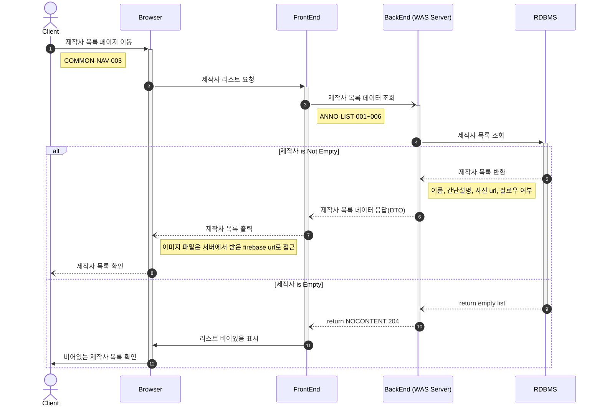
```mermaid
sequenceDiagram
	autonumber

	actor C as Client
	participant B as Browser
  participant FE as FrontEnd
  participant BE as BackEnd (WAS Server)
  participant DB as RDBMS
	
	C->>+B: 제작사 목록 페이지 이동
	note right of C: COMMON-NAV-003
	B->>+FE: 제작사 리스트 요청
	FE-)+BE: 제작사 목록 데이터 조회
	note right of FE: ANNO-LIST-001~006
	BE->>+DB: 제작사 목록 조회
	alt 제작사 is Not Empty
		DB--)BE: 제작사 목록 반환
		note left of DB: 이름, 간단설명, 사진 url, 팔로우 여부
		BE--)FE: 제작사 목록 데이터 응답(DTO)
		FE--)B: 제작사 목록 출력
		note left of FE: 이미지 파일은 서버에서 받은 firebase url로 접근
		B--)C: 제작사 목록 확인
	else 제작사 is Empty
		DB--)-BE: return empty list
		BE--)-FE: return NOCONTENT 204
		FE->>-B: 리스트 비어있음 표시
		B->>-C: 비어있는 제작사 목록 확인
	end

```

### 제작진 리스트 조회

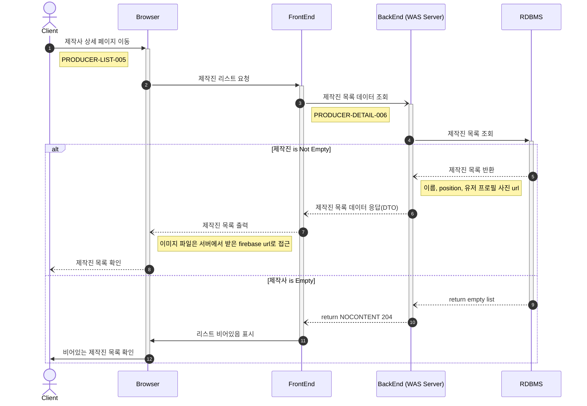
```mermaid
sequenceDiagram
	autonumber

	actor C as Client
	participant B as Browser
  participant FE as FrontEnd
  participant BE as BackEnd (WAS Server)
  participant DB as RDBMS
	
	C->>+B: 제작사 상세 페이지 이동
	note right of C: PRODUCER-LIST-005
	B->>+FE: 제작진 리스트 요청
	FE-)+BE: 제작진 목록 데이터 조회
	note right of FE: PRODUCER-DETAIL-006
	BE->>+DB: 제작진 목록 조회
	alt 제작진 is Not Empty
		DB--)BE: 제작진 목록 반환
		note left of DB: 이름, position, 유저 프로필 사진 url
		BE--)FE: 제작진 목록 데이터 응답(DTO)
		FE--)B: 제작진 목록 출력
		note left of FE: 이미지 파일은 서버에서 받은 firebase url로 접근
		B--)C: 제작진 목록 확인
	else 제작사 is Empty
		DB--)-BE: return empty list
		BE--)-FE: return NOCONTENT 204
		FE->>-B: 리스트 비어있음 표시
		B->>-C: 비어있는 제작진 목록 확인
	end

```

---

## 채용 관리

### 지원자 목록 조회 (필터링이 적용된 조회도 존재)

- 필터링 : 지원 배역, 합격/보류/불합격

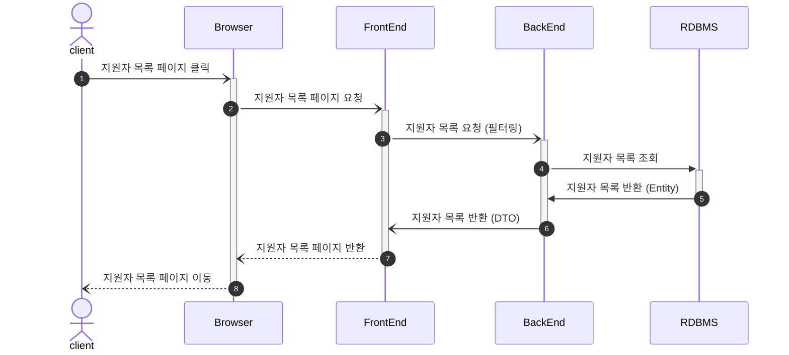
```mermaid
sequenceDiagram
	autonumber

	actor C as client
	participant B as Browser
	participant FE as FrontEnd
	participant BE as BackEnd
	participant DB as RDBMS
	C -) +B: 지원자 목록 페이지 클릭
	B -) +FE: 지원자 목록 페이지 요청
	FE -) +BE: 지원자 목록 요청 (필터링)
	BE ->> +DB: 지원자 목록 조회
	DB ->> -BE: 지원자 목록 반환 (Entity)
	BE -) -FE: 지원자 목록 반환 (DTO)
	FE --) -B: 지원자 목록 페이지 반환
	B --) -C: 지원자 목록 페이지 이동
```

## 지원자 합격/보류/불합격 선택

```mermaid
sequenceDiagram
	autonumber

	actor C as client
	participant B as Browser
	participant FE as FrontEnd
	participant BE as BackEnd
	participant DB as RDBMS
	
	C -) +B: 합격/보류/불합격 클릭
	B -) +FE: 지원자 상태 업데이트 요청
	FE -) +BE: 지원자 상태 업데이트 요청 (UPDATE)
	BE ->> +DB: 지원자 상태 업데이트 쿼리
	alt 업데이트 성공
		DB -->> BE: SUCCESS
		BE --) FE: OK Response
		FE --) B: 지원자 상태 업데이트 표시
		B --) C: 지원자 상태 업데이트		
	else 업데이트 실패
		DB -->> -BE: FAIL
		BE --) -FE: ERROR Response
		FE --) -B: 지원자 상태 변경없음
		B --) -C: error message 출력
	end
```

## 다음 프로세스 진행 시 결과 통보

```mermaid
sequenceDiagram
	autonumber

	actor C as client
	participant B as Browser
	participant FE as FrontEnd
	participant BE as BackEnd
	participant DB as RDBMS
	
	C->>B: 다음 프로세스 시작
	B->>FE: 다음 프로세스 시작 요청
	FE->>BE: 다음 프로세스 요청
	BE->>DB: 해당 프로세스 지원자 조회
	DB-->>BE: 지원자 목록 반환
	BE->>DB: 다음 프로세스 생성
	DB-->>BE: 생성 결과 반환
	alt 합격자
		BE->>DB: process id 업데이트
		DB-->>BE: 업데이트 결과 반환
	end
	BE->>DB: 기존 프로세스 상태 업데이트
	DB-->>BE: 업데이트 결과 반환
	loop 프로세스 결과 통보
		BE->>BE: 결과 통보
	end
```

---

# 등록 & 수정

## 사진, 동영상 등록

```mermaid
sequenceDiagram
	autonumber

	actor C as client
	participant B as Browser
	participant FE as FrontEnd
	participant BE as BackEnd
	participant DB as RDBMS
	participant FB as FireBase

	C->>B: 사진 등록 선택
	B-->>C: 사진 등록 요구
	C->>+B: 등록 사진 선택
	B->>+FE: 사진 등록 요청
	FE->>+FB: 사진 등록
	FB-->>-FE: 사진 url 전달
	FE->>+BE: 사진 등록 요청
	BE->>+DB: 사진 등록
	DB-->>-BE: 등록 결과 반환
	BE-->>-FE: 등록 결과 반환
	FE-->>-B: 등록 결과 표시
	B-->>-C: 등록 결과 확인
```

## 공고 등록 - (배역 추가, 내가 속한 제작사 조회, 사진 등록)

```mermaid
sequenceDiagram
	autonumber

	actor C as Client(제작사)
	participant B as Browser
	participant FE as FrontEnd
	participant BE as BackEnd
	participant DB as RDBMS
	participant FB as FireBase

	C-)+B: 공고 등록 클릭
	B-)+FE: 공고 등록 요청
	FE->>+FB: 사진 등록
	FB-->>-FE: 사진 URL 반환
	Note right of FE: 모집배역 목록, 사진 URL
	Note right of FE: 제작사, 모집 기간
	FE->>+BE: 공고 등록 요청
	BE->>+DB: 공고 등록 요청
	DB-->>-BE: 등록 결과 반환
	BE-->>-FE: 등록 결과 응답
	FE--)-B: 공고 목록 페이지 전달
  B--)-C: 공고 목록으로 이동
```

## 제작진 추가

- 제작사 수정 페이지
- 제작진 리스트 추가
- 유저 목록 반환
- 유저 선택, description 설정, 확인 → DB 반영 →

```mermaid
sequenceDiagram
	autonumber

	actor C as client
	participant B as Browser
	participant FE as FrontEnd
	participant BE as BackEnd
	participant DB as RDBMS
	participant FB as FireBase
	
	C->>B: 제작진 추가 버튼 클릭
	B-->>C: 유저 검색 팝업
	C->>+B: 유저 이메일로 검색
	B-)+FE: 유저 검색 요청
	FE-)+BE: 유저 검색 요청
	BE->>+DB: 유저 이메일로 검색
	DB-->>-BE: 유저 목록 반환
	BE--)-FE: 유저 목록 반환
	FE--)-B: 유저 목록
	B-)+FB: 유저 프로필사진 요청
	FB--)-B: 유저 프로필 사진 반환
	B--)-C: 유저 목록 표시
	loop
	C-)B: 유저 선택
	B-)FE: 제작진 추가 요청
	FE-)FE: 제작진 목록 수정
	end
	C-)+B: 제작사 정보 저장 버튼클릭
	B-)+FE: 제작사 정보 저장 요청
	FE-)+BE: 제작사 정보 업데이트 요청
	BE->>+DB: 제작사 정보 업데이트
	DB-->>-BE: OK
	BE--)-FE: OK
	FE--)-B: 제작사 상세페이지 redirect
	B--)-C: 제작사 상세 페이지
```

---

# 팔로우 기능

## 배우 팔로우/언팔로우

```mermaid
sequenceDiagram
	autonumber

	actor C as Client(제작사)
	participant B as Browser
	participant FE as FrontEnd
	participant BE as BackEnd
	participant DB as RDBMS

	C-)+B: 팔로우 버튼 클릭
	B-)+FE: 팔로우 요청
	FE-)+BE: 배우/공고/제작사 팔로우 요청
	BE->>+DB: 팔로우 정보 조회
	DB-->>BE: 팔로우 정보 반환
	alt 팔로우 O
		BE->>DB: 언팔로우로 변경
	else 팔로우 X
		BE->>DB: 팔로우로 변경
	end
	DB-->>-BE: 팔로우 결과 반환
	BE--)-FE: 팔로우 결과 응답
	FE--)-B: 팔로우 결과 출력
	B--)-C: 팔로우 결과 확인
```

## 공고, 제작사 신고

```mermaid
sequenceDiagram
	autonumber

	actor C as Client(제작사)
	participant B as Browser
	participant FE as FrontEnd
	participant BE as BackEnd
	participant DB as RDBMS
	
	C->>+B: 신고 버튼 클릭
	B->>+FE: 신고 페이지 요청
	FE->>+BE: 신고 카테고리 요청
	BE-->>-FE: 신고 카테고리 전달
	FE-->>-B: 신고 페이지 전달
	B-->>-C: 내용 작성 요청
	C-)B: 내용 작성 완료
	B-)FE: 신고 요청
	FE-)BE: 신고 요청(공고, 제작사)
	BE->>DB: 신고 이력 추가
	DB-->>BE: 신고 결과 반환
	BE--xFE: 신고 결과 응답
```

# 내 정보 관리

## 내 이력서 조회 : 기본 정보 / 필모그래피 / 배우프로필사진+영상 / 팔로워 수

- 팔로워 수 확인
- 기본 정보 조회
- 필모그래피 정보 조회
- 프로필 미디어 조회

```mermaid
sequenceDiagram
	autonumber

	actor C as Client(제작사)
	participant B as Browser
	participant FE as FrontEnd
	participant FB as FireBase
	participant BE as BackEnd
	participant DB as RDBMS
	
	C-)+B: 내 이력서 클릭
	B-)FE: 내 이력서 조회 요청

	FE-)+BE: 기본 정보 조회
	BE->>+DB: 유저 정보 조회
	note right of BE: 유저, 배우 기본 정보
	DB-->>-BE: 기본 정보 조회 결과
	BE--)-FE: 기본 정보
	FE--)B: 기본 정보

	FE-)+BE: 팔로워수 조회
	BE->>+DB: 팔로워 수 조회
	DB-->>-BE: 팔로워 수
	BE--)-FE: 팔로워 수
	FE--)B: 팔로워 수

	FE-)+BE: 필모그래피 정보 조회

	BE->>+DB: 필모그래피 목록 조회
	DB-->>-BE: 필모그래미 목록
	BE--)-FE: 필모그래피 목록
	FE--)B: 필모그래피 정보
	B-)FB: 필모그래피 이미지 요청
	FB--)B: 사진

	FE-)BE: 프로필 미디어 조회(사진, 동영상)
	BE--)FE: 프로필 미디어 목록(사진, 동영상)
	FE--)B: 프로필 미디어 목록 반환
	B-)FB: 프로필 사진, 동영상 요청
	FB--)B: 사진, 동영상
	B--)-C: 내 이력서 페이지

	
```

## 이력서 수정

- 기본정보 DB 에 업데이트
- 파일은 FireBase 저장 - 저장 URL 을 DB에 저장

```mermaid
sequenceDiagram
	autonumber

	actor C as Client(제작사)
	participant B as Browser
	participant FE as FrontEnd
	participant FB as FireBase
	participant BE as BackEnd
	participant DB as RDBMS
	C-)+B: 사진, 영상 추가/삭제	
	B-)+FE: 사진, 영상 추가/삭제 요청
	FE-)FB: 사진, 영상 저장/삭제
	FB--)FE: 저장 URL
	
	C-)+B: 이력서 수정 완료

	B-)+FE: 이력서 수정 요청

	FE-)+BE: 기본정보 수정 요청
	BE->>+DB: 기본정보 수정
	DB-->>-BE: 수정 결과
	BE--)-FE: OK

	FE-)+BE: 필모그래피 목록 수정 요청
	BE->>+DB: 필포그래피 정보 수정 요청
	DB-->>-BE: 수정 결과
	BE--)-FE: OK
	
	FE-)+BE: 사진, 영상 수정 요청
	BE->>+DB: 사진, 영상 정보 수정 요청
	DB-->>-BE: 수정 결과
	BE--)-FE: OK

	FE--)-B: 이력서 페이지 

	B-)-C: 이력서 확인
```

---

## 알림 및 메일 기능

### 메일 보내기

**사용되는 로직**

- 다음 프로세스 진행 시 합격 지원자 대상으로 메일 발송
- 이메일 인증
- 비밀번호 찾기

```mermaid
sequenceDiagram
	autonumber
	actor C as Client
	participant B as Browser
	participant FE as FrontEnd
	participant BE as BackEnd(WAS Server)
	participant DB as RDBMS
  participant M as SMTP
	C->>+B:이메일 발송이 필요한 로직 
	B->>+FE: 이메일 발송이 필요한 로직 호출
	note right of B: MEM-SIGN-002, MEM-LOST-001, CS-EMAIL-005
	note right of B: CS-EMAIL-007, CS-EMAIL-009
	FE-)+BE: 이메일 발송이 필요한 로직 호출
	BE->>+DB: sender, receiver email 조회
	DB--)-BE: return email
	BE->>+M: request send email with content
	M--)-C: send email
	BE--)-FE: 로직 수행 결과 반환
	FE--)-B: 로직 수행 결과 출력
	B--)-C: 로직 수행 결과 확인
  
```

### 알림 보내기

**알림 필요 로직**

- 오디션 합격/불합격 알림 (CS-PUSH-009)
- 팔로워 추가 (CS-PUSH-008) - ⏬
- 팔로워에게 공고 등록 알림 (CS-PUSH-010) - ⏬
- 캐스팅 제의 알림 (CS-PUSH-011) - ⏬
- 오디션 제의 알림 (CS-PUSH-012) - ⏬

```mermaid
sequenceDiagram
	autonumber
	actor C as Client
	participant B as Browser
	participant FE as FrontEnd
	participant BE as BackEnd(WAS Server)
	participant RD as Redis
	participant DB as RDBMS
	C->>+B:알림 발송이 필요한 로직 
	B->>+FE: 알림 발송이 필요한 로직 호출
	note right of B: CS-PUSH-008~012
	FE-)+BE: 알림 발송이 필요한 로직 호출
	loop Do Logic 
		BE->>+DB: request에 대한 로직 수행
		DB--)-BE: 로직에 대한 response
	end
	BE--)-FE: 로직 수행 결과 반환
	FE--)-B: 로직 수행 결과 출력
	B--)-C: 로직 수행 결과 확인
	alt SSE 수행
		BE->>+DB: sender, receiver 정보 조회
		DB--)-BE: return sender, receiver 정보
		BE->>+RD: 알림 메세지 저장
		RD--)-BE: 저장 성공
		BE--)FE: ServerSentEvent 발생
		note left of BE: 읽지 않을 알림 있다고 알림
		loop EventSource: Event 감시
			FE--)FE: EventSource에서 SSE Event 감시
		end
		FE--)B: 읽지 않은 알림 표시 출력
		B--)C: 미수신 알림 확인
	end	
	

  
```

---

## 화상 오디션

```mermaid
sequenceDiagram
	autonumber
	actor P as PD	
	participant BE as BackEnd (Signaling)
	actor A as Actor
	participant V as OpenVidu

	P-)+BE: 화상 오디션 대상자 조회
	BE--)-P: return TargetActor

	P-)+BE: 정해진 오디션 시각에 화상 오디션 콜 요청
	note right of P: 미디어 전송 설정 정보 전달 (Offer SDP)
	
	BE-)+A: 화상 오디션 콜 요청 from PD
	note right of BE : Offer SDP

	A--)-BE: 배우가 화상 오디션 콜 수락
	note left of A: Answer SDP

	BE--)P: 배우의 화상 오디션 콜 수락 전달
	note left of BE: Answer SDP

	P-)BE: PD의 Public IP 등 연결에 필요한 정보 전달
	note right of P: PD의 ICE Candidate 전달

	BE-)A: PD의 Public IP 등 연결에 필요한 정보 전달
	note right of BE: PD의 ICE Candidate 전달

	A--)BE: Actor의 Public IP 등 연결에 필요한 정보 전달
	note left of A: Actor의 ICE Candidate 전달

	BE--)P: Actor의 Public IP 등 연결에 필요한 정보 전달
	note left of BE: Actor의 ICE Candidate 전달

	note over P, V: 화상 오디션 진행

	P-)V: 화상 오디션 종료
	V--)A: 화상 오디션 종료
```